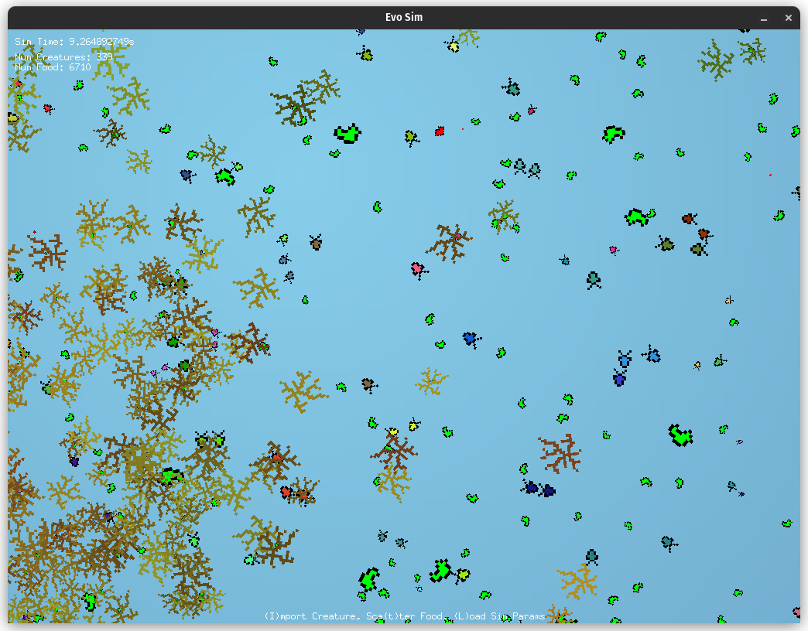

# Ocean - A fun little creature simulator for evolving creatures with brains
This is a game/simulation for evolving simple creatures with neural network brains. The neural networks used are NEAT networks (most of the NEAT algorithm is skipped though), from the package [github.com/JoshPattman/goevo](http://github.com/JoshPattman/goevo). All of the graphics are done using the very cool package [github.com/faiface/pixel](http://github.com/faiface/pixel).

Feel free to download and modify the code to your liking, but if you do use a significant portion of it, please credit me :) I have also included some precompiled binaries for linux and windows, but if you want to compile it yourself, have a look a the makefile. The makefile is setup for comiling from linux to windows though, so i think you might have to modify it for a different os.

## Playing the game
Once you have either compiled or downloaded a binary (`ocean`/`ocean.exe`), run it. Make sure when you do this that the binary is next to the sprites folder. If you don't have this, check out the makefile to see where to get it.

Once the game is running, you should see somthing similar to this:


You can move around the screen with the WASD keys, and you can zoom with the QE keys.

A couple of things to notice:

1) In the top right, you can see some basic info about the sim.
2) Along the bottom are your option keys. The letter in brackets is the key you should press to use them. For example, press the 't' key to use Sca(t)ter Food tool.
3) The blue areas are open area where creatures can be. The black areas are rocks and the creatures cannot be on these.
4) Plants are the green/yellowy-green bits. Plants produce food for creatures.

Lets try to stop all the creatures from dying instantly. Press the 't' key a few times to scatter some food. The food is represented by the green blobs, with the bigger the blob, the more energy left in the food. You may also notice some red blobs, this is food for carnivores. This is produced when a creature dies.

You can also zoom in a bit to see this a bit better.



Now click on a creature. As soon as you have done that, press the button 'f' to make sure the creature dosn't starve to death while we are looking at it.


Some points about this view:
1) The white circle around the creature shows you the creatures sight range. Bigger sight ranges take more energy.
2) In the bottom right, you can see the creatures brain.On the left are inputs, and on the right are outputs. As the creatures evolve more, you may start to see some hidden nodes which appear in pink between the input and output nodes.
3) In the top right, there are some stats about the creature. Have a look into the code to see what each of these things mean in more detail.
4) On the bottom of the screen, your hotkeys have changed. Some notable new ones are the save and load creature. To use these, hold the save or load button, then press one of the number keys on the top of your keyboard. Creatures are saved in a slot system, so holdding 'o'+'3' would save the currently selected creature to slot 3. This will overwrite a creature that is in that slot. You can send your freinds these by sending them `./data/creature_dna_<slot>.json`.

There is no winning in this game, although I think all creatures dying off could be considered losing! You can steer evolution by moving creatures around, feeding, cloning, and killing them. You can also modify the parameters of a creature by saving it to a slot, then modifying the json file for the creature, then loading it again. I would not reccomend trying to change the brains this way though.

One challenging but fun thing to try is to try to grow creatures that have a fully predatory diet that can survive on their own. Another thing you can do is to have a competition with someone else to evolve a creature, then load both creatures onto an empty sim and see which ones can outcompete each other.

## Customising the game
You can customise the games parameters (creature metabolism rate, map size, ...) by editing the `./data/simulation_parameters.json` file. If you edit the file when a simulation is running, you can reload the parameters by pressing the 'l' key. Below is what the default file looks like:

```json
{
  "map_generation": {
    "plant_density": 0.3,
    "plant_coverage": 0.8,
    "map_radius": 400,
    "cave_size": 1,
    "initial_creatures_number": 300
  },
  "plant_growth": {
    "food_growth_delay": 30,
    "grown_food_energy": 5
  },
  "creature_base_values": {
    "max_energy": 1,
    "push_force": 20,
    "metabolism": 0.015,
    "vision": 10,
    "plant_drag": 3,
    "food_eat_rate": 5,
    "drag": 8,
    "angular_drag": 7,
    "rotate_force": 10,
    "metabolism_per_neuron": 0.005
  },
  "creature_balance_values": {
    "conversion_efficiency_damping_plant": 0.5,
    "conversion_efficiency_damping_meat": 0.5,
    "death_energy_threshold": 0.2,
    "predator_efficiency_slope": 0.75,
    "predator_efficiency_percentage": 0.5
  },
  "mutation_parameters": {
    "trait_mutation_rate": 0.2,
    "trait_mutation_size": 0.1,
    "synapse_mutation_probability": 0.2,
    "synapse_mutation_size": 0.1,
    "synapse_growth_probability": 0.15,
    "synapse_growth_size": 0.5,
    "neuron_grow_probability": 0.05,
    "synapse_prune_probability": 0.1
  },
  "environmental_parameters": {
    "food_decay_rate": 0.01,
    "brain_update_delay": 0.2
  }
}
```

Take a look at the code in `simparams.go` to see what each parameter does.

I hope you have fun playing this little game!